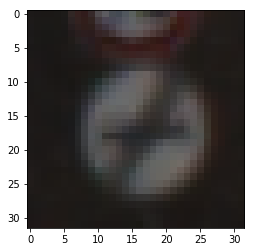
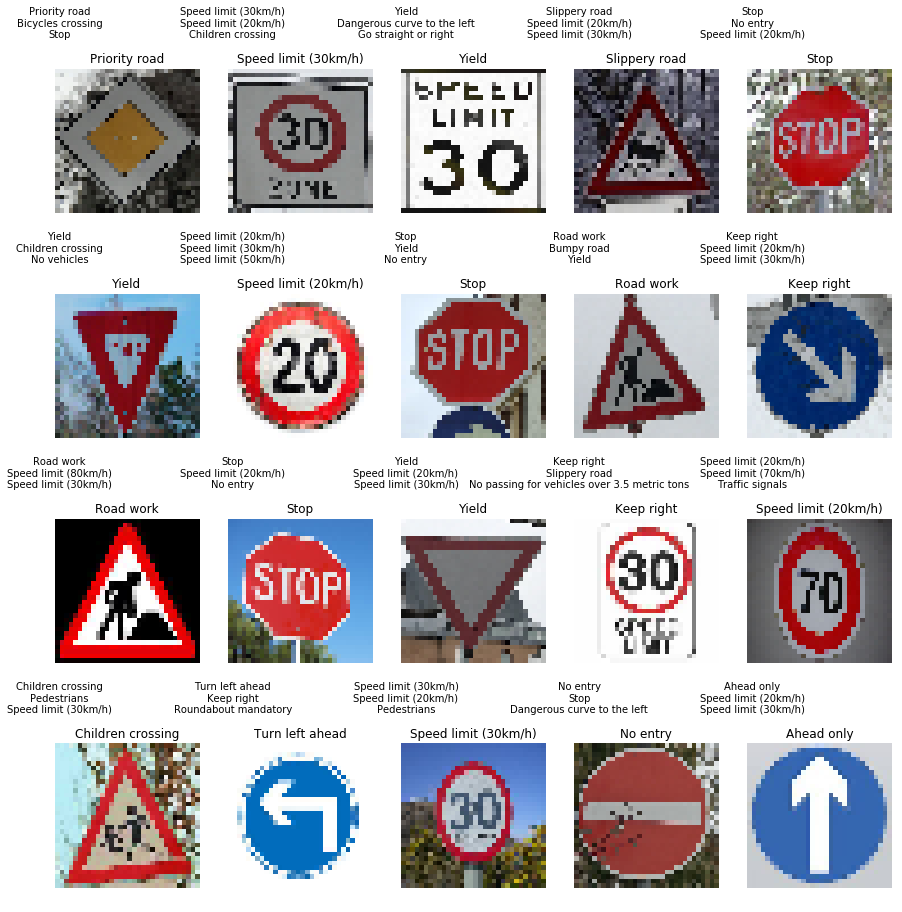

# Traffic Sign Classification

## Project Requirements
- Reliably detect Traffic signs
- Get Accuracy more than 0.93
The goals / steps of this project are the following:
* Load the data set (see below for links to the project data set)
* Explore, summarize and visualize the data set
* Design, train and test a model architecture
* Use the model to make predictions on new images
* Analyze the softmax probabilities of the new images
* Summarize the results with a written report

## Approach
- Using LeNet as the base 
- Trying grayscale images first to see if it is reliable enough
- Modify the input layer/ Add a layer before the input layer of the LeNet Architecture to accomodate rgb image


---
## Step 0: Load The Data


```python
# Load pickled data
import pickle
import random
import numpy as np
import matplotlib.pyplot as plt
%matplotlib inline


training_file = "data/train.p"
validation_file= "data/valid.p"
testing_file = "data/test.p"

with open(training_file, mode='rb') as f:
    train = pickle.load(f)
with open(validation_file, mode='rb') as f:
    valid = pickle.load(f)
with open(testing_file, mode='rb') as f:
    test = pickle.load(f)
    
X_train, y_train = train['features'], train['labels']
X_valid, y_valid = valid['features'], valid['labels']
X_test, y_test = test['features'], test['labels']


```

---

## Step 1: Dataset Summary & Exploration

The pickled data is a dictionary with 4 key/value pairs:

- `'features'` is a 4D array containing raw pixel data of the traffic sign images, (num examples, width, height, channels).
- `'labels'` is a 1D array containing the label/class id of the traffic sign. The file `signnames.csv` contains id -> name mappings for each id.
- `'sizes'` is a list containing tuples, (width, height) representing the original width and height the image.
- `'coords'` is a list containing tuples, (x1, y1, x2, y2) representing coordinates of a bounding box around the sign in the image. **THESE COORDINATES ASSUME THE ORIGINAL IMAGE. THE PICKLED DATA CONTAINS RESIZED VERSIONS (32 by 32) OF THESE IMAGES**

# Data
Pickled data downloaded from [this link](https://d17h27t6h515a5.cloudfront.net/topher/2017/February/5898cd6f_traffic-signs-data/traffic-signs-data.zip)

> Data contains three pickle files,
> - train.p - Training Data , Size 34799 
> - test.p - Test Data, Size 12630
> - valid.p - Validation Data, Size 12630

Each file has an input image(X) and output label(Y)
> - X - size,32,32,3 
> - Y - size,1 

Sample of the input data and description of the data is printed and plotted below


```python


# Data Exploration
#Number of training examples
n_train = len(y_train)
#Number of testing examples.
n_test = len(y_test)
#Shape of an traffic sign image
image_shape = X_train.shape
# Number of unique classes/labels in the dataset.
n_classes = len(np.unique(y_train))

img_size=X_train.shape[1] #Size of input images

print("Size of training Data =", n_train)
print("Size of testing Data =", n_test)
print("Size of validation Data =", n_test)
print("Image shape =", image_shape)
print("Number of classes =", n_classes)

plt.imshow(X_train[0])
```

    Size of training Data = 34799
    Size of testing Data = 12630
    Size of validation Data = 12630
    Image shape = (34799, 32, 32, 3)
    Number of classes = 43


    <matplotlib.image.AxesImage at 0x7fb2a461a048>





# Data Visualization


```python
### Data exploration visualization goes here.
# Visualizations will be shown in the notebook.

num_of_samples=[]
plt.figure(figsize=(12, 16.5))
for i in range(0, n_classes):
    plt.subplot(11, 4, i+1)
    x_selected = X_train[y_train == i]
    plt.imshow(x_selected[0, :, :, :]) #draw the first image of each class
    plt.title(i)
    plt.axis('off')
    num_of_samples.append(len(x_selected))
plt.show()

#Plot number of images per class
plt.figure(figsize=(12, 4))
plt.bar(range(0, n_classes), num_of_samples)
plt.title("Distribution of the train dataset")
plt.xlabel("Class number")
plt.ylabel("Number of images")
plt.show()

print("Min number of images per class =", min(num_of_samples))
print("Max number of images per class =", max(num_of_samples))

```


    Min number of images per class = 180
    Max number of images per class = 2010


# Observation


The data is not evenly distributed. So new data has to be generated to get the model to perform well on those cases.
> - by rotating the data in different angles to create new data seems like a good option. That way we will not have redundant data on the training set


```python

from scipy import ndimage
import random

# min_desired below is just mean_pics but wanted to make the code below easier to distinguish
pics_in_class = np.bincount(y_train)
mean_pics = int(np.mean(pics_in_class))
min_desired = int(mean_pics)

print('Generating new data.')

# Angles to be used to rotate images in additional data made
angles = [-10, 10, -15, 15, -20, 20]

# Iterate through each class
for i in range(len(pics_in_class)):
    
    # Check if less data than the mean
    if pics_in_class[i] < min_desired:
        
        # Count how many additional pictures we want
        new_wanted = min_desired - pics_in_class[i]
        picture = np.where(y_train == i)
        more_X = []
        more_y = []
        
        # Make the number of additional pictures needed to arrive at the mean
        for num in range(new_wanted):
            
            # Rotate images and append new ones to more_X, append the class to more_y
            more_X.append(ndimage.rotate(X_train[picture][random.randint(0,pics_in_class[i] - 1)], random.choice(angles), reshape=False))
            more_y.append(i)
        
        # Append the pictures generated for each class back to the original data
        X_train = np.append(X_train, np.array(more_X), axis=0)
        y_train = np.append(y_train, np.array(more_y), axis=0)
        
print('Additional data generated. Any classes lacking data now have', min_desired, 'pictures.')

plt.hist(y_train, bins = n_classes)

updated_n_train = len(X_train)
print("The updated number of training examples =", updated_n_train)

```

    Generating new data.
    Additional data generated. Any classes lacking data now have 809 pictures.
    The updated number of training examples = 46714


## Step 2: Design and Test a Model Architecture

### Design
> - Data looks a lot similar to MNIST data but with a lot of noise and in RGB instead of grayscale
> - Images look blurry and it might need some preprocessing.
> - Lets see if the LeNet model could learn through this difficult scenario.
> - It is a classification problem with 43 classes
> - Data isn't uniformly aligned, so CNNs sounds like a good option in this case because it could handle geometric transformations very well.
> - Preprocessing of the images might be needed, some images look super dark. If the accuracy isn't as expected, then color boosting would be of a good choice 

### Preprocessing
 - CNNs work better if the i/p data is in and around zero (mean zero). But the images we have the value range from 0-255. So image Normalization is needed before we feed the model into the system. 

 - Tried to convert the data to grayscale and tried it with existing LeNet example. But that doesn't seem to be an efficient approach becase the traffic signs have a lot of color information which could be useful in classifying them. So I decided to use the same image with just normalization.

### Implementation notes
 - Data seems to be not uniform for certain classes, So performed data augmentation by rotating the images.
 - Built a CNN to match the image input 32x32x3, and added dropout layers for better training of the model.
 - Gray scale image conversion was tried and the results aren't that impressive using the Lenet example.
 - Modyfied the hyper parameters to get better results.
 - Batch size and Learning rate affected the Performance a lot compared to other parameters
 - Drop out layer probability, did a huge improvement of the model.
 - Using Adam optimizer for the model because it is an efficient optimizer. The method computes individual adaptive learning rates for different parameters from estimates of first and second moments of the gradients. [Ref](https://machinelearningmastery.com/adam-optimization-algorithm-for-deep-learning/)

# CNN Architecture
Using LeNet as the base for the project. Taking it from the [example](https://github.com/udacity/CarND-LeNet-Lab)
- References 
> - [Example](https://github.com/jeremy-shannon/CarND-Traffic-Sign-Classifier-Project)

| Layer | Input | Output  | Description | Filter Size |
|-------|-------|---------|-------------|--------------|
| CNN-1 | 32x32x3 | 30x30x32  | RGB Image, input image with stride 1 and valid padding |
| CNN-2 | 30x30x32 | 28x28x32  | CNN with stride 1 and valid padding |
| Pooling | 28x28x32 | 14x14x32  | 2x2 max pool |
| CNN-3 | 14x14x32 | 12x12x64  | CNN with stride 1 and valid padding |
| CNN-4 | 12x12x64 | 10x10x64  | CNN with stride 1 and valid padding |
| Pooling | 10x10x64 | 5x5x64  | 2x2 max pool |
| CNN-4 | 5x5x64 | 3x3x128  | CNN with stride 1 and valid padding |
| Flatten | 3x3x128 | 1152  | Flatten the layer |
| FC-1 | 1152 | 1024  | Fully connected Layer |
| ReLU | 1024 | 1024  | Activation |
| DO | 1024 | 1024  | DropOut |
| FC-2 | 1024 | 1024  | Fully connected Layer |
| ReLU | 1024 | 1024  | Activation |
| DO | 1024 | 1024  | DropOut |
| FC-3 | 1024 | 43  | Fully connected Layer |

I started with the LeNet example. That model seems to work well with hand written code recognition and it is proven to be one of the best. Current dataset isn't as easy as MNIST Data, it has complex information and the data is noisy and blurry too. With the LeNet model I could not be able to get the accuracy that I was expecting. So I modied the CNNs to be deeper to improve the results.

That doesn't seem to give me more than 60% accuracy in first 50 epochs. So I started modyfing the Fully connected layers to see if the result changes. Looks like that made a huge impact in the model. I got around 90% accuracy. From the references I see that dropout layers could be something that could make the model more reliable. Which apparently improved the accuracy to around 93%.

Then by adjusting the batch size and learning rate, I could be able to achieve 96-97% accuracy.


## Import TensorFlow and Preprocess Data

Shuffle the training data. Configure training parameters. 


```python
from sklearn.utils import shuffle
import tensorflow as tf
from tensorflow.contrib.layers import flatten
X_train, y_train = shuffle(X_train, y_train)

X_train = X_train / 255 

EPOCHS = 100
BATCH_SIZE = 256
```


```python
def LeNet(x):    
    # Arguments used for tf.truncated_normal, randomly defines variables for the weights and biases for each layer
    mu = 0
    sigma = 0.1
    
    # Layer 1: Convolutional. Input = 32x32x3. Output = 30x30x32.
    conv1_W = tf.Variable(tf.truncated_normal(shape=(3, 3, 3, 32), mean = mu, stddev = sigma))
    conv1_b = tf.Variable(tf.zeros(32))
    conv1   = tf.nn.conv2d(x, conv1_W, strides=[1, 1, 1, 1], padding='VALID') + conv1_b
    conv1   = tf.nn.relu(conv1)

    # Layer 2: Convolutional. Output = 28x28x32.
    conv2_W = tf.Variable(tf.truncated_normal(shape=(3, 3, 32, 32), mean = mu, stddev = sigma))
    conv2_b = tf.Variable(tf.zeros(32))
    conv2   = tf.nn.conv2d(conv1, conv2_W, strides=[1, 1, 1, 1], padding='VALID') + conv2_b
    conv2   = tf.nn.relu(conv2)

    # Pooling. Input = 28x28x32. Output = 14x14x32.
    conv2 = tf.nn.max_pool(conv2, ksize=[1, 2, 2, 1], strides=[1, 2, 2, 1], padding='VALID')
    conv2 = tf.nn.dropout(conv2, keep_prob)

    # Layer 3: Convolutional. Iutput = 14x14x32. Output = 12x12x64
    conv3_W = tf.Variable(tf.truncated_normal(shape=(3, 3, 32, 64), mean = mu, stddev = sigma))
    conv3_b = tf.Variable(tf.zeros(64))
    conv3   = tf.nn.conv2d(conv2, conv3_W, strides=[1, 1, 1, 1], padding='VALID') + conv3_b
    conv3   = tf.nn.relu(conv3)

    # Layer 4: Convolutional. Iutput = 12x12x64. Output = 10x10x64
    conv4_W = tf.Variable(tf.truncated_normal(shape=(3, 3, 64, 64), mean = mu, stddev = sigma))
    conv4_b = tf.Variable(tf.zeros(64))
    conv4   = tf.nn.conv2d(conv3, conv4_W, strides=[1, 1, 1, 1], padding='VALID') + conv4_b
    conv4   = tf.nn.relu(conv4)

    # Pooling. Input = 10x10x64. Output = 5x5x64.
    conv4 = tf.nn.max_pool(conv4, ksize=[1, 2, 2, 1], strides=[1, 2, 2, 1], padding='VALID')
    conv4 = tf.nn.dropout(conv4, keep_prob)

    # Layer 5: Convolutional. Iutput = 5x5x64. Output = 3x3x128
    conv5_W = tf.Variable(tf.truncated_normal(shape=(3, 3, 64, 128), mean = mu, stddev = sigma))
    conv5_b = tf.Variable(tf.zeros(128))
    conv5   = tf.nn.conv2d(conv4, conv5_W, strides=[1, 1, 1, 1], padding='VALID') + conv5_b
    conv5   = tf.nn.relu(conv5)

    # Flatten. Input = 3x3x128. Output = 1152.
    fc0   = flatten(conv5)

    # Layer 3: Fully Connected. Input = 1152. Output = 1024.
    fc1_W = tf.Variable(tf.truncated_normal(shape=(1152, 1024), mean = mu, stddev = sigma))
    fc1_b = tf.Variable(tf.zeros(1024))
    fc1   = tf.matmul(fc0, fc1_W) + fc1_b

    # Activation.
    fc1 = tf.nn.relu(fc1)
    fc1 = tf.nn.dropout(fc1, keep_prob)

    # Layer 4: Fully Connected. Input = 1024. Output = 1024.
    fc2_W  = tf.Variable(tf.truncated_normal(shape=(1024, 1024), mean = mu, stddev = sigma))
    fc2_b  = tf.Variable(tf.zeros(1024))
    fc2    = tf.matmul(fc1, fc2_W) + fc2_b

    # Activation.
    fc2 = tf.nn.relu(fc2)
    fc2 = tf.nn.dropout(fc2, keep_prob)

    # Layer 5: Fully Connected. Input = 1024. Output = 43.
    fc3_W       = tf.Variable(tf.truncated_normal(shape=(1024, 43), mean = mu, stddev = sigma))
    fc3_b       = tf.Variable(tf.zeros(43))
    logits = tf.matmul(fc2, fc3_W) + fc3_b
    return logits
```


```python

tf.reset_default_graph()
x = tf.placeholder(tf.float32, (None, 32, 32, 3))
y = tf.placeholder(tf.int32, (None))
one_hot_y = tf.one_hot(y, 43)

rate = 0.0009
kp = 0.85
keep_prob = tf.placeholder(tf.float32)
logits = LeNet(x)
cross_entropy = tf.nn.softmax_cross_entropy_with_logits(labels=one_hot_y, logits=logits)
loss_operation = tf.reduce_mean(cross_entropy)
optimizer = tf.train.AdamOptimizer(learning_rate = rate)
training_operation = optimizer.minimize(loss_operation)
```


```python
correct_prediction = tf.equal(tf.argmax(logits, 1), tf.argmax(one_hot_y, 1))
accuracy_operation = tf.reduce_mean(tf.cast(correct_prediction, tf.float32))
saver = tf.train.Saver()

def evaluate(X_data, y_data):
    num_examples = len(X_data)
    total_accuracy = 0
    sess = tf.get_default_session()
    for offset in range(0, num_examples, BATCH_SIZE):
        batch_x, batch_y = X_data[offset:offset+BATCH_SIZE], y_data[offset:offset+BATCH_SIZE]
        accuracy = sess.run(accuracy_operation, feed_dict={x: batch_x, y: batch_y, keep_prob: 1.0})
        total_accuracy += (accuracy * len(batch_x))
    return total_accuracy / num_examples

```


```python
with tf.Session() as sess:
    sess.run(tf.global_variables_initializer())
    num_examples = len(X_train)
    
    print("Training...")
    print()
    for i in range(EPOCHS):
        X_train, y_train = shuffle(X_train, y_train)
        for offset in range(0, num_examples, BATCH_SIZE):
            end = offset + BATCH_SIZE
            batch_x, batch_y = X_train[offset:end], y_train[offset:end]
            sess.run(training_operation, feed_dict={x: batch_x, y: batch_y,keep_prob: kp})
            
        validation_accuracy = evaluate(X_valid, y_valid)
        print("EPOCH {} ...".format(i+1))
        print("Validation Accuracy = {:.3f}".format(validation_accuracy))
        print()
        
    saver.save(sess, './lenet')
    print("Model saved")
```

    Training...
    
    EPOCH 1 ...
    Validation Accuracy = 0.808
    
    EPOCH 2 ...
    Validation Accuracy = 0.901
    
    EPOCH 3 ...
    Validation Accuracy = 0.930
    
    EPOCH 4 ...
    Validation Accuracy = 0.920
    
    EPOCH 5 ...
    Validation Accuracy = 0.939
    
    EPOCH 6 ...
    Validation Accuracy = 0.931
    
    EPOCH 7 ...
    Validation Accuracy = 0.943
    
    EPOCH 8 ...
    Validation Accuracy = 0.945
    
    EPOCH 9 ...
    Validation Accuracy = 0.944
    
    EPOCH 10 ...
    Validation Accuracy = 0.946
    
    EPOCH 11 ...
    Validation Accuracy = 0.940
    
    EPOCH 12 ...
    Validation Accuracy = 0.953
    
    EPOCH 13 ...
    Validation Accuracy = 0.944
    
    EPOCH 14 ...
    Validation Accuracy = 0.943
    
    EPOCH 15 ...
    Validation Accuracy = 0.964
    
    EPOCH 16 ...
    Validation Accuracy = 0.944
    
    EPOCH 17 ...
    Validation Accuracy = 0.966
    
    EPOCH 18 ...
    Validation Accuracy = 0.949
    
    EPOCH 19 ...
    Validation Accuracy = 0.946
    
    EPOCH 20 ...
    Validation Accuracy = 0.948
    
    EPOCH 21 ...
    Validation Accuracy = 0.954
    
    EPOCH 22 ...
    Validation Accuracy = 0.946
    
    EPOCH 23 ...
    Validation Accuracy = 0.959
    
    EPOCH 24 ...
    Validation Accuracy = 0.963
    
    EPOCH 25 ...
    Validation Accuracy = 0.969
    
    EPOCH 26 ...
    Validation Accuracy = 0.966
    
    EPOCH 27 ...
    Validation Accuracy = 0.923
    
    EPOCH 28 ...
    Validation Accuracy = 0.965
    
    EPOCH 29 ...
    Validation Accuracy = 0.968
    
    EPOCH 30 ...
    Validation Accuracy = 0.953
    
    EPOCH 31 ...
    Validation Accuracy = 0.959
    
    EPOCH 32 ...
    Validation Accuracy = 0.950
    
    EPOCH 33 ...
    Validation Accuracy = 0.958
    
    EPOCH 34 ...
    Validation Accuracy = 0.957
    
    EPOCH 35 ...
    Validation Accuracy = 0.957
    
    EPOCH 36 ...
    Validation Accuracy = 0.957
    
    EPOCH 37 ...
    Validation Accuracy = 0.958
    
    EPOCH 38 ...
    Validation Accuracy = 0.970
    
    EPOCH 39 ...
    Validation Accuracy = 0.956
    
    EPOCH 40 ...
    Validation Accuracy = 0.949
    
    EPOCH 41 ...
    Validation Accuracy = 0.958
    
    EPOCH 42 ...
    Validation Accuracy = 0.963
    
    EPOCH 43 ...
    Validation Accuracy = 0.956
    
    EPOCH 44 ...
    Validation Accuracy = 0.968
    
    EPOCH 45 ...
    Validation Accuracy = 0.963
    
    EPOCH 46 ...
    Validation Accuracy = 0.943
    
    EPOCH 47 ...
    Validation Accuracy = 0.965
    
    EPOCH 48 ...
    Validation Accuracy = 0.969
    
    EPOCH 49 ...
    Validation Accuracy = 0.956
    
    EPOCH 50 ...
    Validation Accuracy = 0.962
    
    EPOCH 51 ...
    Validation Accuracy = 0.912
    
    EPOCH 52 ...
    Validation Accuracy = 0.957
    
    EPOCH 53 ...
    Validation Accuracy = 0.956
    
    EPOCH 54 ...
    Validation Accuracy = 0.956
    
    EPOCH 55 ...
    Validation Accuracy = 0.970
    
    EPOCH 56 ...
    Validation Accuracy = 0.964
    
    EPOCH 57 ...
    Validation Accuracy = 0.954
    
    EPOCH 58 ...
    Validation Accuracy = 0.966
    
    EPOCH 59 ...
    Validation Accuracy = 0.965
    
    EPOCH 60 ...
    Validation Accuracy = 0.957
    
    EPOCH 61 ...
    Validation Accuracy = 0.973
    
    EPOCH 62 ...
    Validation Accuracy = 0.966
    
    EPOCH 63 ...
    Validation Accuracy = 0.952
    
    EPOCH 64 ...
    Validation Accuracy = 0.967
    
    EPOCH 65 ...
    Validation Accuracy = 0.959
    
    EPOCH 66 ...
    Validation Accuracy = 0.970
    
    EPOCH 67 ...
    Validation Accuracy = 0.964
    
    EPOCH 68 ...
    Validation Accuracy = 0.937
    
    EPOCH 69 ...
    Validation Accuracy = 0.966
    
    EPOCH 70 ...
    Validation Accuracy = 0.961
    
    EPOCH 71 ...
    Validation Accuracy = 0.960
    
    EPOCH 72 ...
    Validation Accuracy = 0.956
    
    EPOCH 73 ...
    Validation Accuracy = 0.963
    
    EPOCH 74 ...
    Validation Accuracy = 0.966
    
    EPOCH 75 ...
    Validation Accuracy = 0.970
    
    EPOCH 76 ...
    Validation Accuracy = 0.963
    
    EPOCH 77 ...
    Validation Accuracy = 0.962
    
    EPOCH 78 ...
    Validation Accuracy = 0.968
    
    EPOCH 79 ...
    Validation Accuracy = 0.967
    
    EPOCH 80 ...
    Validation Accuracy = 0.960
    
    EPOCH 81 ...
    Validation Accuracy = 0.967
    
    EPOCH 82 ...
    Validation Accuracy = 0.962
    
    EPOCH 83 ...
    Validation Accuracy = 0.973
    
    EPOCH 84 ...
    Validation Accuracy = 0.968
    
    EPOCH 85 ...
    Validation Accuracy = 0.978
    
    EPOCH 86 ...
    Validation Accuracy = 0.969
    
    EPOCH 87 ...
    Validation Accuracy = 0.975
    
    EPOCH 88 ...
    Validation Accuracy = 0.960
    
    EPOCH 89 ...
    Validation Accuracy = 0.975
    
    EPOCH 90 ...
    Validation Accuracy = 0.973
    
    EPOCH 91 ...
    Validation Accuracy = 0.960
    
    EPOCH 92 ...
    Validation Accuracy = 0.960
    
    EPOCH 93 ...
    Validation Accuracy = 0.970
    
    EPOCH 94 ...
    Validation Accuracy = 0.967
    
    EPOCH 95 ...
    Validation Accuracy = 0.973
    
    EPOCH 96 ...
    Validation Accuracy = 0.968
    
    EPOCH 97 ...
    Validation Accuracy = 0.959
    
    EPOCH 98 ...
    Validation Accuracy = 0.974
    
    EPOCH 99 ...
    Validation Accuracy = 0.964
    
    EPOCH 100 ...
    Validation Accuracy = 0.959
    
    Model saved


# Validation
Validating the model with test data and some sample images on test directory. The test image set has clear images, high contrast images, blurry images, tilted images. This will make sure that the model is performing well or not on new data which the model had never seen. This will help in understanding the performance of the model. 

The images are bright compared to the training dataset. The data is taken from the [reference.](https://github.com/eqbal/CarND-Traffic-Sign-Classifier-Project) 


```python
#good values lr = 0.0009,kb = 0.85, batch = 256, epoch - 200
import os
import cv2

test_images = []
test_y = np.array([29,9,36,25,28])
path = './test/'
prediction = tf.argmax(logits, 1)
softmax_logits = tf.nn.softmax(logits)
top_k = tf.nn.top_k(softmax_logits, k=10)


for image in os.listdir(path):
    img = cv2.imread(path + image)
    img = cv2.resize(img, (32,32))
    img = cv2.cvtColor(img, cv2.COLOR_BGR2RGB)
    test_images.append(img/255)
              
test_images = np.array(test_images)
test_y = np.array([12,1,1,23,14,13,0,14,25,38,25,14,13,1,4,28,34,1,17,35])
output = []
with tf.Session() as sess:
    sess.run(tf.global_variables_initializer())
    saver2 = tf.train.import_meta_graph('./lenet.meta')
    saver2.restore(sess, "./lenet")
    
    test_accuracy = evaluate(X_test, y_test)
    realImage_accuracy = evaluate(test_images, test_y)
    output = sess.run(prediction,feed_dict={x:test_images,keep_prob:1.0})
    output_top_k = sess.run(top_k,feed_dict={x:test_images,keep_prob:1.0})
    print(output)
    #print(X_test.shape)
    #print(X_test[0],y_test)
    print("Test Accuracy = {:.3f}".format(test_accuracy))
    print("Real Data Accuracy = {:.3f}".format(realImage_accuracy))

```

    [12  1 13 23 14 13  0 14 25 38 25 14 13 38  0 28 34  1 17 35]
    Test Accuracy = 0.939
    Real Data Accuracy = 0.850


# Plotting the output 
The input images are mapped with the output(lookup) below. It is 85% accurate with the images. Because the training data contains few computer generated images which were predicted wrong.

Top 5 match for the particular prediction was also printed on the image in the order of the match from top to bottom.


```python
print(output_top_k[1])
```

    [[12 29 14 17 38 13 26 40 42  0]
     [ 1  0 28 29 23  2 38  3 20 21]
     [13 19 36 17 18 26 34  1  0  2]
     [23  0  1  2  3  4  5  6  7  8]
     [14 17  0  1  2  3  4  5  6  7]
     [13 28 15 35 36 18  1  0  2  3]
     [ 0  1  2  3  4  5  6  7  8  9]
     [14 13 17 12 26 38  3  5 10  0]
     [25 22 13 29 28 34 36 21  1 26]
     [38  0  1  2  3  4  5  6  7  8]
     [25  5  1 13 29 36 14 10 28  2]
     [14  0 17  1  2  3  4  5  6  7]
     [13  0  1  2  3  4  5  6  7  8]
     [38 23 10 40  9 13 26  2 31 19]
     [ 0  4 26 40 27 24 10  1  8  2]
     [28 27  1 11  0 24 23  8 30 39]
     [34 38 40 41 36 39 32  0  1  2]
     [ 1  0 27 24  4 37 40  2 28 32]
     [17 14 19  0 39  1 26 20  3 38]
     [35  0  1  2  3  4  5  6  7  8]]


```python
import csv
import os
import cv2
import matplotlib.pyplot as plt

%matplotlib inline

signnames = {}

with open('signnames.csv', 'rt') as csvfile:
    signreader = csv.reader(csvfile)
    for x in signreader:
        signnames[x[0]] = x[1]

test_images = []
path = './test/'

plt.figure(figsize=(15, 20))

for image in os.listdir(path):
    img = cv2.imread(path + image)
    img = cv2.resize(img, (32,32))
    img = cv2.cvtColor(img, cv2.COLOR_BGR2RGB)
    test_images.append(img)
              
test_images = np.array(test_images)
test_images = test_images/255
print(test_images.shape)
for i, image in enumerate(test_images):
    grid = plt.subplot(len(test_images)/4,5,i+1)
    grid.imshow(image), plt.axis('off')
    grid.set_title(signnames[str(output[i])])
    txt = ""
    for j in range(3):
        txt += signnames[str(output_top_k[1][i][j])]
        txt += "\n"
    txt += "\n\n"
    grid.text(0.6, 0.5,txt,
     horizontalalignment='center')


plt.show()

for i in range(20):
    print("Image :",i+1)
    print("Actual Data : ",signnames[str(test_y[i])] )
    print("Predicted Data : ")
    for j in range(5):
        print(signnames[str(output_top_k[1][i][j])], "\t\t " ,output_top_k[0][i][j])                                 

```

    (20, 32, 32, 3)





    Image : 1
    Actual Data :  Priority road
    Predicted Data : 
    Priority road 		  1.0
    Bicycles crossing 		  2.29393e-29
    Stop 		  4.20098e-32
    No entry 		  1.01714e-33
    Keep right 		  2.8742e-36
    Image : 2
    Actual Data :  Speed limit (30km/h)
    Predicted Data : 
    Speed limit (30km/h) 		  0.999295
    Speed limit (20km/h) 		  0.000535032
    Children crossing 		  0.000169938
    Bicycles crossing 		  6.09797e-11
    Slippery road 		  1.20102e-11
    Image : 3
    Actual Data :  Speed limit (30km/h)
    Predicted Data : 
    Yield 		  1.0
    Dangerous curve to the left 		  1.1952e-33
    Go straight or right 		  5.6941e-34
    No entry 		  2.7795e-35
    General caution 		  1.77418e-36
    Image : 4
    Actual Data :  Slippery road
    Predicted Data : 
    Slippery road 		  1.0
    Speed limit (20km/h) 		  0.0
    Speed limit (30km/h) 		  0.0
    Speed limit (50km/h) 		  0.0
    Speed limit (60km/h) 		  0.0
    Image : 5
    Actual Data :  Stop
    Predicted Data : 
    Stop 		  1.0
    No entry 		  2.17169e-37
    Speed limit (20km/h) 		  2.69366e-38
    Speed limit (30km/h) 		  0.0
    Speed limit (50km/h) 		  0.0
    Image : 6
    Actual Data :  Yield
    Predicted Data : 
    Yield 		  1.0
    Children crossing 		  3.58142e-33
    No vehicles 		  1.22648e-33
    Ahead only 		  7.08861e-35
    Go straight or right 		  4.69e-37
    Image : 7
    Actual Data :  Speed limit (20km/h)
    Predicted Data : 
    Speed limit (20km/h) 		  1.0
    Speed limit (30km/h) 		  0.0
    Speed limit (50km/h) 		  0.0
    Speed limit (60km/h) 		  0.0
    Speed limit (70km/h) 		  0.0
    Image : 8
    Actual Data :  Stop
    Predicted Data : 
    Stop 		  1.0
    Yield 		  3.1326e-10
    No entry 		  2.19003e-10
    Priority road 		  1.86327e-13
    Traffic signals 		  5.74876e-16
    Image : 9
    Actual Data :  Road work
    Predicted Data : 
    Road work 		  1.0
    Bumpy road 		  5.24336e-14
    Yield 		  2.33301e-14
    Bicycles crossing 		  7.11667e-16
    Children crossing 		  7.83526e-18
    Image : 10
    Actual Data :  Keep right
    Predicted Data : 
    Keep right 		  1.0
    Speed limit (20km/h) 		  0.0
    Speed limit (30km/h) 		  0.0
    Speed limit (50km/h) 		  0.0
    Speed limit (60km/h) 		  0.0
    Image : 11
    Actual Data :  Road work
    Predicted Data : 
    Road work 		  0.999999
    Speed limit (80km/h) 		  1.05807e-06
    Speed limit (30km/h) 		  2.14679e-08
    Yield 		  7.16783e-09
    Bicycles crossing 		  5.22811e-09
    Image : 12
    Actual Data :  Stop
    Predicted Data : 
    Stop 		  1.0
    Speed limit (20km/h) 		  2.23341e-37
    No entry 		  4.98728e-38
    Speed limit (30km/h) 		  0.0
    Speed limit (50km/h) 		  0.0
    Image : 13
    Actual Data :  Yield
    Predicted Data : 
    Yield 		  1.0
    Speed limit (20km/h) 		  0.0
    Speed limit (30km/h) 		  0.0
    Speed limit (50km/h) 		  0.0
    Speed limit (60km/h) 		  0.0
    Image : 14
    Actual Data :  Speed limit (30km/h)
    Predicted Data : 
    Keep right 		  0.533838
    Slippery road 		  0.187776
    No passing for vehicles over 3.5 metric tons 		  0.136837
    Roundabout mandatory 		  0.0356908
    No passing 		  0.0257678
    Image : 15
    Actual Data :  Speed limit (70km/h)
    Predicted Data : 
    Speed limit (20km/h) 		  0.683519
    Speed limit (70km/h) 		  0.316481
    Traffic signals 		  1.64863e-29
    Roundabout mandatory 		  6.01138e-30
    Pedestrians 		  2.47557e-30
    Image : 16
    Actual Data :  Children crossing
    Predicted Data : 
    Children crossing 		  1.0
    Pedestrians 		  8.05295e-20
    Speed limit (30km/h) 		  1.32587e-21
    Right-of-way at the next intersection 		  3.80921e-22
    Speed limit (20km/h) 		  6.0642e-23
    Image : 17
    Actual Data :  Turn left ahead
    Predicted Data : 
    Turn left ahead 		  1.0
    Keep right 		  4.45495e-22
    Roundabout mandatory 		  4.83827e-24
    End of no passing 		  6.89822e-29
    Go straight or right 		  1.02423e-33
    Image : 18
    Actual Data :  Speed limit (30km/h)
    Predicted Data : 
    Speed limit (30km/h) 		  0.995243
    Speed limit (20km/h) 		  0.00453407
    Pedestrians 		  0.000198975
    Road narrows on the right 		  1.08126e-05
    Speed limit (70km/h) 		  9.95152e-06
    Image : 19
    Actual Data :  No entry
    Predicted Data : 
    No entry 		  1.0
    Stop 		  1.07802e-24
    Dangerous curve to the left 		  1.04605e-24
    Speed limit (20km/h) 		  6.06044e-26
    Keep left 		  8.2056e-29
    Image : 20
    Actual Data :  Ahead only
    Predicted Data : 
    Ahead only 		  1.0
    Speed limit (20km/h) 		  0.0
    Speed limit (30km/h) 		  0.0
    Speed limit (50km/h) 		  0.0
    Speed limit (60km/h) 		  0.0


 The test image set has clear images, high contrast images, blurry images, tilted images. This will make sure that the model is performing well or not on new data which the model had never seen. This will help in understanding the performance of the model. 

Image 1: Priority road. Data is clear and looks lot similar to what we see in dataset

Image 2: SpeedLimit, data similar to what we see on the dataset. So it predicted it right

Image 3: SpeedLimit but the model predicted it to be Yield. The image isn't like what we trained it with. It is a computer generated image. So the model isn't performing well

Image 14 : SpeedLimit 30, but the model predicted keep right. It is because the image doesn't look like the training images. These are computer generated images. 

Image 15: Speed Limit "70" Eventhough it looks similar to what we see in the dataset, It got confused with Speed Limit "20". So I think the model has to be trained more with Speed Limit 70.

The accuracy of the model should not get affected by the brightness and contrast. But looks like it does on some data like computer generated images.

# Results
There is a little confusion on the results where the speedlimit numbers aren't exactly accurate. Giving more speed limit data would help the model to perform well.

- one more add on would be training on a high dimensional dataset (64x64x3) will give more clarity than 32x32x3 dataset
- I was thinking about doing color enhancement preprocessing on the data.

# Possible Improvements
> - Additional data on speed limit numbers like speed limit 20 would have helped the model perform better on those data
> - Testing out this on a video feed on realtime to get the feel of the application

Author: Surjith Bhagavath Singh


```python

```
